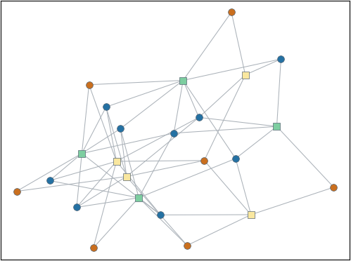
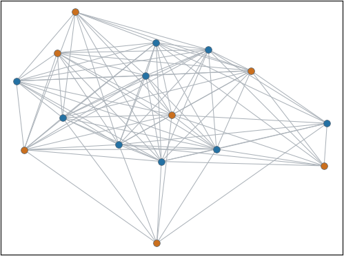

# small-world-networkx
Small-world network analysis using NetworkX

## Network

Network (network.py) is a data structure for small-world person-to-group networks, for example: students and their links to courses. Networks can provide many small-world analysis metrics such as the largest component, the person-to-person and binary person-to-person network, and, for the latter networks, mean (unique) co-enrollments, number of unique edges, network density, average clustering coefficient, characteristic path length, network diameter, and k-step reach.

## Dependencies

Requires installation of [NetworkX](https://pypi.org/project/networkx/) and [NumPy](https://numpy.org/).

## Examples

Tests of most methods and examples of using the methods can be found in networkTester.py (uses the example files file1.csv, file2.csv, file3.csv).

## Visualizing Networks

The file createVisual.py demonstrates how to use Networks to draw their person-to-group and person-to-person networks with [Matplotlib](https://matplotlib.org/) (also requires installation).  From the example files:

Person-to-group example (persons are circles, groups are squares, each of which are organized by 'type').

Person-to-person example.

